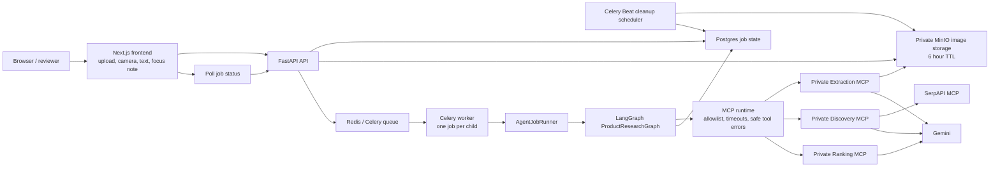
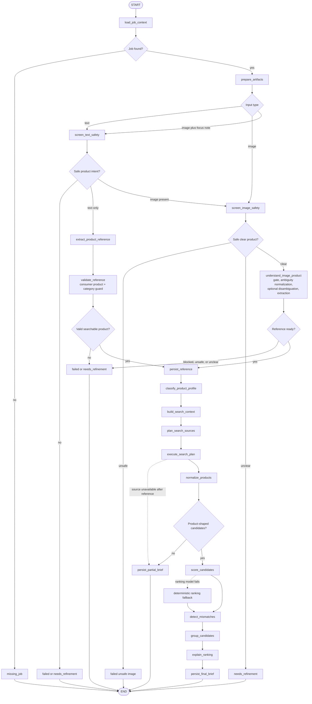
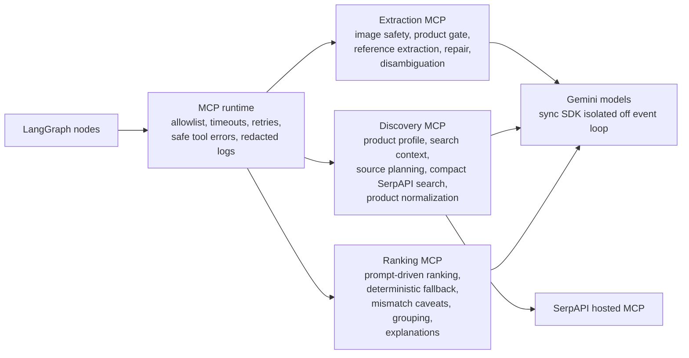
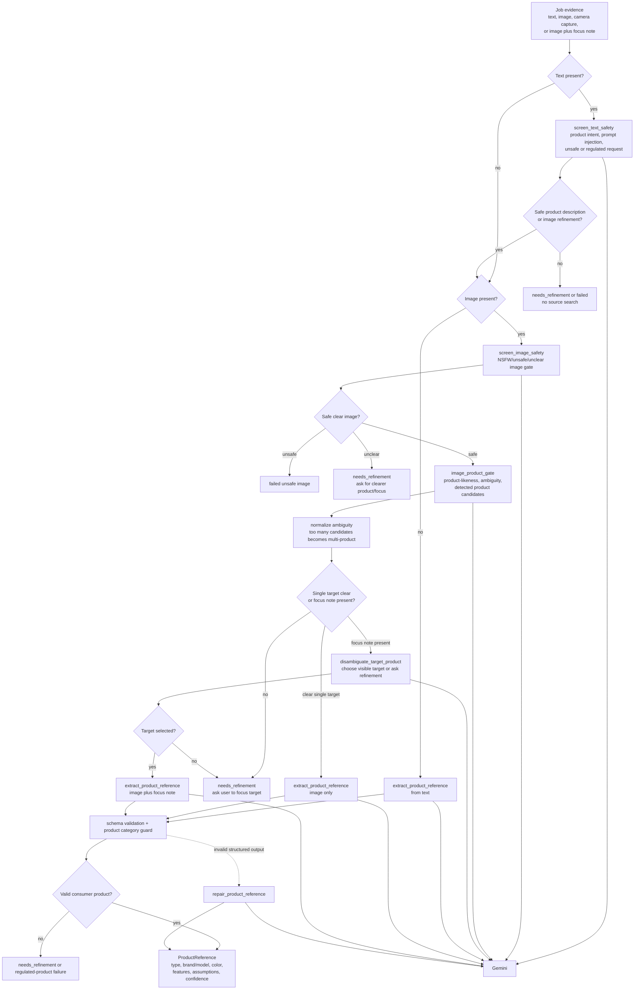
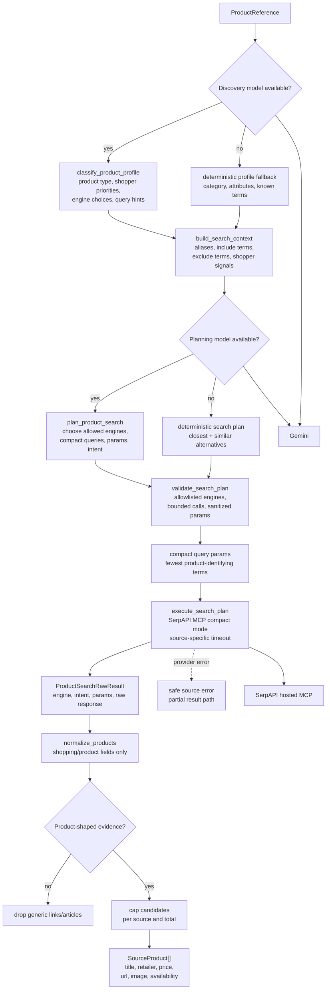
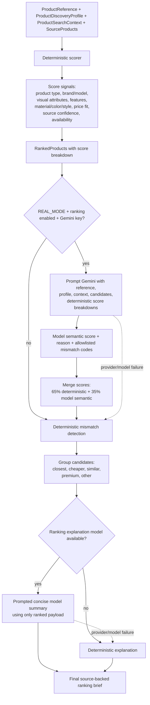

# ThriftLens Approach

# IMP note : the mermaid flow diagrams are best viewed on Github / .md viewer

## 1. What I Built And Why I Picked This Problem

### Product

ThriftLens is a deployed AI product research app. A user can start from messy product evidence: an uploaded image, a camera capture, a text description, or an image plus a short focus note. The app turns that evidence into a structured product reference, searches live source-backed product results, ranks possible matches, and shows the result with price context, alternatives, source links, caveats, and uncertainty.

The finished workflow is:

1. Capture product evidence from image, camera, text, or image plus text.
2. Screen the input for unsafe content, prompt-injection intent, non-product requests, and ambiguous product evidence.
3. Extract a structured product reference.
4. Build a product profile: what kind of item this is, what shoppers usually compare, and which details matter.
5. Plan bounded live source searches through SerpAPI MCP.
6. Normalize only product-shaped results before rendering.
7. Rank candidates with prompt-driven model judgment plus deterministic scoring and fallback.
8. Present best available matches, grouped alternatives, source evidence, price context, and safe failure/partial states.

Live app: https://thriftlens-web.onrender.com/

API health: https://thriftlens-api.onrender.com/api/health

### Local Review Path

```bash
cp .env.example .env
# Add GEMINI_API_KEY and SERPAPI_API_KEY for REAL_MODE.
docker compose down
docker compose up --build
```

`PROVIDER_MODE=REAL_MODE` is the default in `.env.example`, so reviewers exercise the live Gemini and SerpAPI path after adding those two keys. For a no-key smoke path, `PROVIDER_MODE=SAMPLE_MODE` uses deterministic fixtures.

### User And Problem

The target user is someone who sees a product but does not know exactly what it is, how to search for it, what similar alternatives exist, or what the price range should be. That shows up in ordinary situations: screenshots, resale listings, room photos, outfits, store shelves, and shared images.

The first complete slice is everyday consumer product research: clothing, bags, furniture, home goods, accessories, electronics, and similar retail products. I deliberately avoided checkout, affiliate links, long-term accounts, and marketplace-specific workflows so the core AI research loop could be polished.

### Why I Picked It

I chose the “Build the Mini-App You’d Actually Use” option. The product has a useful recurring hook: turn visual curiosity into source-backed product research. It is small enough to ship as a take-home, but messy enough that AI matters.

A normal search box works when the user already knows the right query. ThriftLens is for the moments before that: “the lamp on the left,” “this red shirt,” “a bag like this one,” or “what is this product called?” The value is not just finding one answer. It is helping the user explore similar, cheaper, premium, or adjacent products while still seeing why each match is or is not trustworthy.

### Where AI Matters

AI is not bolted on as chat. It is used inside bounded product stages:

- Gemini screens image safety and product suitability.
- Model-assisted text safety checks whether the text is actually a product description or an image refinement note.
- Gemini extracts structured product references from text/image evidence.
- Product discovery uses model-assisted profiling to identify product type, shopper priorities, important details, and search strategy.
- Source search is still bounded by code: only allowed engines and validated query plans are used.
- Ranking combines prompt-driven model judgment, deterministic product signals, mismatch caveats, and source-grounded explanations.

The model is allowed to reason where the input is messy. It is not allowed to invent products, bypass the workflow, or act directly on arbitrary user instructions.

### Verification

Verification was split into automated suites for repeatable risk areas and manual scenario testing for the end-to-end product behavior that depends on live providers and visual review.

Automated checks reviewers can run:

```bash
# Compose/deployment wiring:
# validates service definitions, env interpolation, profiles, and commands.
docker compose config --quiet

# Backend suite:
# API, gateway, worker orchestration, provider resilience, MCP runtime,
# ranking behavior, cleanup, and persistence-focused tests.
docker compose run --rm api python -m pytest tests -q

# Focused v2 agent checks:
# LangGraph runner state transitions, product-understanding branches,
# ranking server scoring/grouping/fallback behavior.
docker compose run --rm --no-deps api python -m pytest tests/test_v2_agent_runner.py tests/test_ranking_mcp_tools.py -q

# Runtime/env documentation checks:
# verifies required runtime knobs are represented in the committed examples.
python3 -m unittest backend.tests.test_runtime_infrastructure_static

# Frontend production build:
# catches Next.js type/build regressions and static asset issues.
docker compose run --rm --build frontend npm run build

# Frontend smoke checks:
# critical workbench route, navigation, and UI behavior.
docker compose --profile test run --rm frontend-e2e

# Formatting safety:
# catches trailing whitespace and patch hygiene issues before submission.
git diff --check
```

Manual scenario testing covered:

- Valid text-only product descriptions such as specific shirts, bags, lamps, and chairs.
- Broad but valid descriptions that should either continue or ask for clearer product evidence.
- Prompt-injection text, link/list/rank requests, malformed text, and non-product questions.
- Unsafe or regulated product text that should stop before live source search.
- Clear image-only products that should pass safety, extraction, discovery, ranking, and briefing.
- Multi-object images that should ask for focus instead of guessing.
- Image plus focus note, including malicious or divergent focus notes.
- Unsafe/NSFW images, which should produce a generic cannot-process state.
- Source/provider unavailable states, which should preserve safe partial/failure behavior.
- Grouped result exploration, best-available-match caveats, copy brief, retry, and refine flows.
- Light/dark themes, mobile responsiveness, progress substates, and no horizontal overflow.
- Camera capture, retake, crop, upload fallback, and image plus focus note.
- MinIO retention cleanup using a short test TTL before restoring the default six-hour TTL.

What exists today is a practical regression suite plus a manual scenario checklist. What I did not build yet is a formal evaluation harness with scored fixtures for expected extraction fields, blocked-input classifications, and ranking outputs across a fixed benchmark set.

### Development Workflow Overview

The development process was intentionally agent-directed but spec-controlled. `AGENTS.md` defines the working rules for this repo: preserve secrets, keep `.env.example` documented, prefer small complete slices, use specs before implementation, and verify behavior before marking a feature complete.

The main loop was:

1. **Spec Architect pass:** define or refine the feature in `/specs`, including objective, behavior, acceptance criteria, error states, and out-of-scope boundaries.
2. **Software Engineer pass:** implement the smallest useful slice, wire it into the existing FastAPI/Celery/LangGraph/MCP/frontend boundaries, and add tests for the acceptance criteria.
3. **Review Agent pass:** compare implementation against the spec, note gaps in a `REVIEW*.md` file where useful, and tighten behavior or docs before moving on.
4. **Manual product review:** run the app locally or on Render, test realistic product scenarios, and use those observations to refine UI, copy, safety gates, ranking output, and deployment settings.

This workflow is visible in the repo through the feature specs, review notes, targeted backend tests, frontend smoke tests, `.env.example` synchronization, and the staged implementation of runtime infrastructure, provider resilience, MCP servers, ranking, workbench redesign, camera capture, cleanup, and Render deployment.

Skills were used as guardrails rather than as a replacement for review. The `uncodixfy` UI skill helped steer the frontend away from generic dashboard patterns during the workbench and landing-page polish. The spec-driven workflow and cleanup guidance kept feature work scoped around acceptance criteria, maintainable boundaries, and reviewer-run commands.

## 2. Key Decisions And Tradeoffs

### The Hardest Part

The hardest part was not making a vision call. The hard part was making the output safe, source-backed, and honest enough to trust.

The important failure modes were:

- The user input might be unsafe, regulated, prompt-injected, malformed, or not a product request.
- The image might show people, many objects, a non-product scene, or an ambiguous target.
- The model might extract plausible but unsupported details.
- Live search might return generic links instead of products.
- Ranking might be tempted to overclaim an exact match.
- Providers can fail, rate limit, or become slow during a demo.

Those risks shaped the system more than any single UI feature.

### Production-Shaped Architecture

The backend uses the production-shaped path by default.



The stable infrastructure stayed intentionally boring:

- FastAPI handles job creation, validation, CORS, health, and polling APIs.
- Celery runs background jobs so slow model/search calls do not block the request.
- Postgres is the durable job state source.
- Redis is the queue/broker.
- MinIO stores private uploaded images and camera captures.
- Celery Beat performs scheduled image cleanup.
- The frontend polls job state and renders progress, refinement, partial, and final states.

### V1 To V2: Fixed Pipeline To LangGraph

The original backend shape was a fixed workflow pipeline: load job, run image/text extraction, search, rank, persist. It was straightforward, but as the product hardened, the branching logic became the real product: unsafe input, ambiguous image, text-only product, image plus focus note, partial research, ranking fallback, and retryable provider failures all needed explicit terminal states.

The final version moves that control flow into `AgentJobRunner` and a LangGraph state machine. There is no long-lived v1/v2 switch in the product path; the LangGraph/MCP-backed architecture is the final runtime. Legacy workflow code remains only where older isolated tests still exercise provider behavior.

The graph owns stage order and terminal states. Models and MCP tools make bounded judgments inside specific nodes.



### Unbounded Agent Loop Vs Graph Orchestration

I considered a more autonomous ReAct-style loop for product understanding. The risk is that a free loop can become harder to debug, harder to test, and easier to push outside the intended product boundary. For this app, top-level autonomy did not improve the user experience enough to justify the reliability cost.

The final design uses graph orchestration with model prompts and tool calls inside bounded nodes:

- The graph decides which stage runs next.
- Prompts decide semantic judgments inside that stage.
- Tool calls are allowlisted and routed through MCP clients.
- Terminal states are explicit and persisted.
- Provider errors map to safe user-facing states.

This gives the useful part of agentic behavior without making the entire job an unbounded model loop.

One important provider tradeoff: I tested a more ReAct-style image understanding loop, but Gemini 3.x bound-tool transcripts through the LangChain path ran into provider `thought_signature` constraints. I kept the product-understanding behavior, but moved the production path to graph-controlled MCP sequencing. That gave the app model-powered perception without fragile tool transcript state.

### Prompts Vs Tool Calls

Prompts are used where judgment is required: safety classification, product extraction, product profile/search strategy, and semantic ranking. Tool calls are used where the system needs bounded actions: loading an image, searching sources, normalizing products, scoring candidates, grouping matches, persisting job state, and cleaning up images.

That separation matters. The model can say “this is likely a red cotton crew neck shirt” or “material is not confirmed,” but code decides whether the result is schema-valid, source-backed, product-shaped, safe to render, and allowed to advance to the next graph node.

### MCP And Tool Boundaries

I split AI/source capabilities into modular MCP services:

- **Extraction MCP:** image safety, image product gate, product reference extraction, repair, and target disambiguation.
- **Discovery MCP:** product profiling, query planning, SerpAPI MCP search execution, result normalization, and product-shaped filtering.
- **Ranking MCP:** candidate scoring, mismatch detection, grouping, and concise source-grounded explanations.

The shared MCP runtime owns connection config, tool discovery, allowlisting, timeout/retry policy, circuit-breaker handling at the graph/client boundary, and secret-redacted logging.



This was intentionally more modular than a single provider file. It makes the system easier to reason about, lets each capability evolve independently, and keeps source integrations behind a replaceable boundary.

One operational detail in the current implementation is that synchronous provider and object-storage SDK calls are pushed through worker threads from async code. That keeps the graph, MCP servers, upload path, ranking calls, and cleanup jobs from pinning the async event loop while an external SDK call is slow.

### Extraction Server

The Extraction MCP server owns product perception and input safety. It is the first place where messy user evidence becomes structured product evidence, and it can stop the workflow before any source search happens.



The graph remains in control of the stage transitions. The extraction tools make bounded model judgments and return structured contracts; the graph decides whether to fail, ask for refinement, or continue to discovery.

### Discovery Server

The Discovery MCP server owns product research before ranking. It turns the extracted reference into a shopper-aware search strategy, calls source tools, and filters results down to product-shaped candidates.



This server is where the live-source latency tradeoff shows up. The search plan is bounded and validated before execution, and normalization prevents generic web links from becoming product cards. The current implementation also requests compact SerpAPI MCP responses, compresses search queries to the most product-identifying terms, and caps normalized candidates so ranking stays useful without carrying unnecessary source payload.

### Ranking Server

The Ranking MCP server is hybrid rather than purely model-driven.



The deterministic layer gives every candidate a stable baseline and fallback. The prompt-driven layer improves semantic judgment and user-facing reasoning, but it can only use the extracted reference, product profile, search context, source product fields, and deterministic score breakdowns. If the ranking model fails or returns unusable output, the deterministic ranked list still ships.

### Live Research Latency Tradeoff

The slowest step in the current product is live source research through SerpAPI-backed search. That is an intentional tradeoff for this take-home. ThriftLens is trying to demonstrate the full end-to-end agent research loop: product understanding, source planning, live discovery, normalization, ranking, caveats, and explanation. Live source scrape/search results give better result diversity and help with lesser-known products, but they cost latency.

I chose that accuracy and coverage tradeoff over making the research step feel instant with only cached fixtures or a narrow catalog. The app mitigates the wait with progress states, timeouts, partial results, safe provider failures, and conservative rendering. The bottleneck remains real, especially when the search plan runs multiple source queries or upstream search is slow.

### Other Decisions

- **SerpAPI first:** SerpAPI hosted MCP gave the fastest reliable path to source-backed shopping/search results. It is the first discovery provider, not the only possible one.
- **Product-shaped normalization:** Search results must look like products before they appear as cards. This prevents prompt-injected or unsafe text from leaking into generic web-link results.
- **Conservative exact-match behavior:** If a candidate is not strong enough, the UI says “best available match” rather than pretending an exact match was verified.
- **Safe fallbacks:** Ranking uses a prompt-driven model layer when enabled, but model failure falls back to deterministic scoring. Research failure after extraction produces a partial brief. Provider failure before extraction becomes a retryable safe error.
- **Private temporary images:** Uploaded and captured images are private MinIO artifacts with a six-hour TTL. Unsafe images use the same retention policy; they are not sent to downstream research.
- **Camera as frontend perception:** Camera capture creates the same `File` as upload, so backend validation, storage, safety, extraction, and cleanup remain unchanged.
- **Render for deployment:** Render was chosen for a credible live deployment in the time available. The production blueprint is managed in `render.yaml`.

### Reliability And Safety

The app is designed to fail visibly rather than quietly inventing results.

Input guardrails:

- Text must be a product description or an image refinement note.
- “Find/list/rank/buy/open this source” style instructions are rejected before search.
- Unsafe and regulated product categories are blocked.
- Non-product and malformed text asks for a clearer product description.
- Ambiguous images ask for focus instead of guessing.
- Multi-product image gates are normalized conservatively: if multiple candidates are detected and no focus note is present, the app asks for refinement before extraction.

Provider/source guardrails:

- Missing live keys are surfaced through health/configuration state.
- Provider errors are mapped to safe user-facing messages.
- Circuit breakers prevent repeatedly hammering unavailable providers.
- Source failures after extraction preserve the extracted reference as a partial result.
- Synchronous Gemini, SerpAPI-adjacent, MinIO upload, and cleanup calls are isolated from async orchestration so slow SDK calls do not block the graph event loop.
- Live discovery requests use compact source payloads, compact product-shaped queries, and candidate caps to reduce ranking overhead.
- Secret values and secret-bearing URLs are not returned to the browser or persisted in trace metadata.

UI guardrails:

- The user sees progress stages instead of a stuck spinner.
- The original image/text evidence remains visible during and after a job.
- Result cards show concise match reasons and caveats.
- Trust/evidence copy explains whether results are source-backed, partial, or best-available.

### Deployment

The app is deployed on Render:

- Web: https://thriftlens-web.onrender.com/
- API health: https://thriftlens-api.onrender.com/api/health

The Render deployment mirrors the local Docker Compose service split:

- public Next.js web service
- public FastAPI API service
- Celery worker
- Celery Beat scheduler
- private Extraction MCP service
- private Discovery MCP service
- private Ranking MCP service
- Render Postgres
- Render Key Value queue
- private MinIO object storage with persistent disk

Render-specific infrastructure is declared in the root `render.yaml` Blueprint. Local Docker Compose remains the primary fallback review path.

The Celery worker is intentionally conservative for the demo deployment: one worker process, one prefetched task, and `max-tasks-per-child=1`. That means each research job gets a fresh child process. The tradeoff is a little extra process churn between jobs, but it reduces the chance that leaked MCP streams, stale async state, or provider memory growth carries into the next submitted research job. For this product shape, job isolation matters more than peak throughput.

## 3. What I Intentionally Left Out

I cut anything that did not strengthen the core research loop:

- User accounts and saved history.
- Price alerts and long-term tracking.
- Checkout, affiliate links, or purchase flows.
- Browser extension/share-sheet capture.
- Retailer-specific deep scraping beyond SerpAPI-backed discovery.
- Full product-field editing UI.
- Full production AWS infrastructure.
- Making API docs the primary review path; the intended review path is the product UI.

These are all plausible next steps, but they would have diluted the take-home slice.

## 4. What Breaks First Under Pressure

- **Provider quota, latency, and availability:** Gemini and SerpAPI are the first operational bottlenecks. The app handles failures, but throughput still depends on provider limits, cost, and transient upstream outages such as `503 Service Unavailable`.
- **Provider migration burden:** Moving to a more reliable model provider is feasible because the graph already talks to extraction, discovery, and ranking through capability boundaries. It is not a trivial config-only swap, though. The work would be moderate: add a provider adapter, map multimodal inputs and structured-output behavior to the new SDK, retune prompts/schemas for image safety, extraction, discovery planning, and ranking, then rerun the blocked-input, messy-image, and ranking test matrix. The API, job lifecycle, MCP service shape, frontend, storage, and polling model should mostly stay unchanged.
- **Live search quality:** Search results depend on upstream shopping/search coverage. Obscure products or vague descriptions may produce weak alternatives.
- **Ambiguous evidence:** Crowded images still need user refinement.
- **Ranking confidence:** Exact-match detection is conservative by design; users may see “best available match” more often than a shopping app would.
- **Small deployment resources:** Render starter services are fine for a demo, but not for sustained concurrent traffic.
- **Object storage choice:** MinIO is production-feasible for this submission shape, but managed S3-compatible storage is the cleaner long-term production option.
- **No authentication:** The take-home demo is intentionally open. A real public launch would need auth, per-user quotas, stronger abuse controls, and protected operational surfaces.

## 5. What I Would Build Next

The next useful product work would be:

- Saved research history and repeat comparison sessions.
- Price tracking and alerts.
- Better retailer/product-page verification.
- User-controlled filters for price, style, retailer, and confidence.
- A browser extension or mobile share sheet for faster capture.
- A deeper “best price quote” workflow where the agent can compare listings, shipping, discounts, seller trust, and availability.
- Budget-aware purchase assistance: with explicit user confirmation, the agent could find and place an order within a user-provided budget and constraints.
- Adversarial product comparison after results are returned: choose two candidate products and have the system argue tradeoffs, mismatches, value, and confidence side by side.
- Per-user quotas and abuse controls.
- Managed production storage, observability, autoscaling worker pools, and secret management.

The next technical focus would be formal evaluation and a more model-agnostic agent platform:

- Turn the manual scenario checklist into a benchmark set of messy product images/descriptions, expected extraction fields, expected blocked inputs, and expected ranking behavior.
- Benchmark different models for extraction, safety, search planning, and ranking so routing choices are based on measured quality, latency, and cost.
- Move more provider-specific code behind model-agnostic interfaces so Gemini, OpenAI, Anthropic, or future Luma-hosted models can be swapped or routed per task.
- Add model routing policies that choose lighter models for low-risk extraction/repair and stronger models for ambiguous visual reasoning or high-impact ranking.
- Add more discovery providers behind the Discovery MCP server while keeping the graph’s tool allowlist and product-shaped normalization.
- Add RAG-backed product/category knowledge bases for faster common-product lookup before live search, while still using live sources for freshness and price evidence.
- Run source searches concurrently with bounded parallelism where provider limits allow it, recognizing that parallelism helps but does not remove upstream scrape/search latency.
- Restrict deep nesting of source results and follow-up lookups so the research step remains bounded even when a provider returns rich but slow result trees.
- Tune worker lifecycle for larger production traffic: move from `max-tasks-per-child=1` to a measured `3-5`, add memory-per-child caps, autoscale worker pools, and preserve the pre-soft-limit async cancellation path.
- Add a dedicated observability MCP server or trace service for long-running agent flows, with redacted node/tool spans, provider timings, circuit-breaker state, and ranking explanations.

That would make future prompt/model/provider changes safer because they could be compared against stable expected outcomes instead of only ad hoc manual review.
